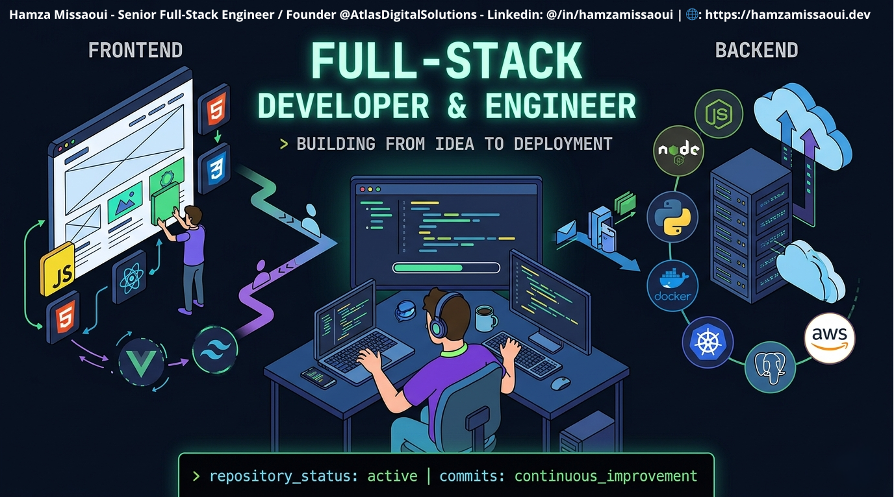

# Hello, I'm Hamza Missaoui

<!--  -->

# 🚀 About Me

<h3 style="color: #00D4AA">Full-Stack AI Engineer, Cloud Architect & Founder | DevOps</h3>

 

As a seasoned Full-Stack AI Engineer with nearly 5 years of experience, I specialize in architecting scalable, AI-driven, cloud-native ecosystems. My expertise lies in transforming concepts into production-ready applications, building distributed microservices, and implementing event-driven systems using Domain-Driven Design patterns. With a deep focus on CI/CD automation, observability, and GenAI integration, I drive measurable business value for my clients. My proficiency in multi-cloud environments (AWS, GCP, Azure) enables me to provide tailored solutions that meet the unique needs of each project.

I am proficient in several languages, including:

* Arabic (Native)
* English (Professional)
* French (Professional, C1)
* German (Basic)

I am always eager to learn new languages and expand my skill set.

 

**What I'm Working On:**
- 🏗️ Cloud-native architectures (AWS, Azure, GCP)
- 🤖 Agentic AI & LLM-powered applications
- 🚀 Scalable SaaS platforms, cloud-native solutions, microservices, SEO optimization & event driven architectures 
- ⚡ CI/CD automation & infrastructure as code

**Atlas Digital Solutions Ltd:**
**[https://www.hamzamissaoui.online](https://www.hamzamissaoui.online)**

<!-- - 📧 Email: **[contact@hamzamissaoui.dev](mailto:contact@hamzamissaoui.dev)** -->
<!-- - 💻 Website: **[https://www.hamzamissaoui.dev](https://www.hamzamissaoui.dev)** -->
<!-- - 💻 Atlas Digital Solutions Ltd (Tempo Domain): **[https://www.hamzamissaoui.online](https://www.hamzamissaoui.online)** -->

 

---

 

# 🌐 Contact & Socials:

  
  
  
  
  
  

  
  

---

<!--   -->
  

<!-- # 🎓 Projects & Certifications -->

 

---

 

    

 
 

# 📊 GitHub Stats:

<!--   -->
<!--  -->

  <!--  -->
<!--   -->
  

# 💻 Tech Stack:

                                   	     

<!--  -->
<!--    -->

  

---

 

# Skills & Tools:

<table align="center" style="border: none; border-collapse: collapse;">
  <!-- ================= Programming & Scripting ================= -->
  <tr>
    <td colspan="8" align="left" style="border: none; padding: 8px 0;"><b> 🖥️ Programming & Scripting</b></td>
  </tr>
  <tr align="center">
    <td> JS</td>
    <td> Typescript</td>
    <td> Python</td>
    <!-- <td> C++</td> -->
    <td> C#</td>
    <td> Go</td>
    <!-- <td> Go</td> -->
    <!-- <td> Rust</td> -->
  </tr>
  <!-- ================= AI / LLM / ML ================= -->
  <tr style="margin:8px 0;">
    <td colspan="8" align="left" style="border: none; padding: 8px 0;"><b>🤖 AI & ML</b></td>
  </tr>
  <tr align="center">
    <!-- <td> Chatgpt</td>
    <td> Anthropic</td> -->
    <!-- <td> TensorFlow</td> -->
    <td> LangChain</td>
    <td> Ollama</td>
    <td> Hugging Face</td>
    <td> MCP</td>
    <td> PyTorch</td>
    <td> OpenRouter</td>
  </tr>
  <!-- ================= Backend & APIs ================= -->
  <tr>
    <td colspan="8" align="left" style="border: none; padding: 8px 0;"><b>⚙️ Backend & APIs</b></td>
  </tr>
  <tr align="center">
    <td> Node.js</td>
    <td> Express</td>
    <td> Koa</td>
    <td> Nestjs</td>
    <td> Django</td>
    <td> FastAPI</td>
    <td> .Net Core</td>
    <td> .Net Spring Boot</td>
    <!-- <td> .Net</td> -->
  </tr>
  <!-- ================= Frontend ================= -->
  <tr>
    <td colspan="8" align="left" style="border: none; padding: 8px 0;"><b>🎨 Frontend, UI & Automation</b></td>
  </tr>
  <tr align="center">
    <td> React</td>
    <td> Next.js</td>
    <td> Vite.js</td>
    <!-- <td> Vue.js</td> -->
    <!-- <td> HTML5</td> -->
    <td> ShadcnUi</td>
    <td> CSS</td>
    <td> TailwindCss</td>
    <!-- <td> Sass</td> -->
    <td> MUI</td>
  </tr>
  <!-- ================= Databases ================= -->
  <tr>
    <td colspan="8" align="left" style="border: none; padding: 8px 0;"><b>💾 Databases & TypeORMs</b></td>
  </tr>
  <tr align="center">
    <td> MongoDB</td>
    <!-- <td> MySQL</td> -->
    <td> PostgreSQL</td>
    <td> Redis</td>
    <td> Supabase</td>
    <td> Prisma</td>
    <td> Firebase</td>
    <td> SQLite</td>
    <!-- <td> SQLite</td> -->
  </tr>
  <!-- ================= DevOps & Cloud ================= -->
  <tr>
    <td colspan="8" align="left" style="border: none; padding: 8px 0;"><b>☁️ DevOps & Cloud</b></td>
  </tr>
  <tr align="center">
    <td> AWS</td>
    <td> Azure</td>
    <td> GCP</td>
    <td> Docker</td>
    <td> Serverless</td>
    <td> Vercel</td>
    <!-- <td> Netlify</td>
    <td> Render</td>
    <td> Railway</td> -->
  </tr>
  <!-- ================= Tools & Platforms ================= -->
  <tr>
    <td colspan="8" align="left" style="border: none; padding: 8px 0;"><b>🧰 Tools & Platforms</b></td>
  </tr>
  <tr align="center">
    <td> Git</td>
    <td> GitHub</td>
    <td> Bitbucket</td>
    <td> Nginx</td>
    <td> NPM</td>
    <td> Bun</td>
    <td> Yarn</td>
    <td> PNPM</td>
  </tr>

 <!-- ================= Data Science & Analytics ================= -->
<tr>
    <td colspan="7" align="left" style="border: none; padding: 8px 0;"><b>📊 Data Science & Analytics</b></td>
  </tr>
  <tr align="center">
    <td> NumPy</td>
    <td> Pandas</td>
    <td> Matplotlib</td>
    <td> Scikit-Learn</td>
    <td> Jupyter</td>
    <td> Hadoop</td>
</tr>

  <!-- ================= OS & Infra ================= -->
  <tr>
    <td colspan="7" align="left" style="border: none; padding: 8px 0;"><b>🖥️ OS & Virtual</b></td>
  </tr>
  <tr align="center">
    <!-- <td> Win Server</td> -->
    <td> Windows</td>
    <td> Linux</td>
    <td> Ubuntu</td>
    <td> VirtualBox</td>
    <td> ProxmoxVE</td>
  </tr>

  <!-- ================= IDEs & Platforms ================= -->
  <tr>
    <td colspan="7" align="left" style="border: none; padding: 8px 0;"><b>💻 IDEs & Platforms</b></td>
  </tr>
  <tr align="center">
    <td> Cursor</td>
    <td> VS Code</td>
    <td> WebStorm</td>
    <td> Windsurf</td>
    <td> IntelliJ</td>
    <td> PyCharm</td>
    <td> Anaconda</td>
  </tr>
</table>

<!--   -->

<!-- --- -->

 

<!-- 

  
Let's build something amazing together! 🚀
 

 -->
