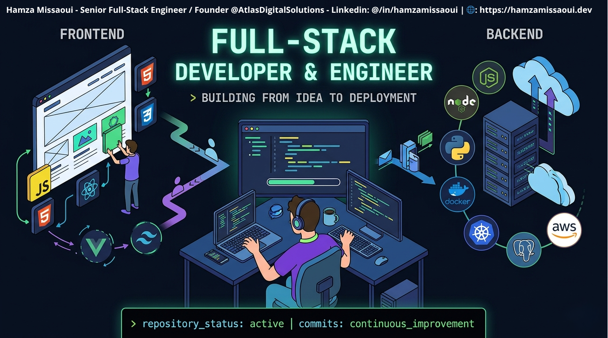

## Hi, I'm Hamza Missaoui

  <strong style="color: #00D4AA;">Full-Stack Engineer & CTO, Multi-Cloud Enthusiast, DevOps and AI/GenAI Integration</strong>

<!--  -->

Senior Full-Stack AI Engineer building production SaaS platforms, AI-powered applications, and cloud-native systems. Skilled in Python, TypeScript, backend APIs, real-time features, LLM/RAG workflows, MCP-based agentic AI, and highthroughput microservices, with hands-on experience across AWS, GCP, and Azure. Known for delivering scalable, production-grade solutions end-to-end, modernizing DevOps pipelines, and aligning technical execution with stakeholder and business goals.

<!-- I specialize in architecting scalable, AI-driven, cloud-native ecosystems. My expertise lies in transforming concepts into production-ready applications, building distributed microservices, and implementing event-driven systems using Domain-Driven Design patterns. With a deep focus on CI/CD automation, observability, and GenAI integration, I drive measurable business value for my clients. My proficiency in multi-cloud environments (AWS, GCP, Azure) enables me to provide tailored solutions that meet the unique needs of each project. -->

<!-- 
 -->

Languages

**Spoken Languages:** - **Arabic:** Native - **English:** Professional - **French:** Professiona

## DevScale Digital Solutions

DevScale is an IT consulting company specializing in cloud-native architecture, AI-driven solutions, and scalable digital transformation. We help businesses modernize their infrastructure, implement intelligent automation, and build future-ready applications.

### Services Working On

<!-- | Area                     | Technologies                                               |
| ------------------------ | ---------------------------------------------------------- |
| Cloud                    | AWS, Azure, GCP, Serverless, Lambda                        |
| LLMs & AI                | Generative AI, Agentic AI, LLM-powered, RAG                |
| DevOps & Automation      | CI/CD, IaC, Observability                                  |
| Architectures & Patterns | SaaS, Microservices, EDA, TDA, DDD, Cloud-Native, MVP, MVC | -->

<!-- ### Services: -->

- IT Consulting & Projects Ownership
- Full-Stack Web Development & SaaS Solutions
- Cloud infrastructures & Cloud-Native Applications
- ERP Apps Development
- Quality Assurance & Advanced Testing
- AI Integration & AI Agents
- DevOps & CI/CD
- Domain Driven Design (DDD), Test Driven Architecture (TDA), Event-Driven Architecture (EDA) & Microservices
      <!-- - System Design & Technical Consulting -->
- UX Design & Video Monitoring

### Contact & Socials:

- 📧 Email: **[contact@hamzamissaoui.dev](mailto:contact@hamzamissaoui.dev)**
- 🌐 Portfolio: **[https://www.hamzamissaoui.dev](https://www.hamzamissaoui.dev)**
- 🌐 certifications: **[https://certifications.hamzamissaoui.online](https://certifications.hamzamissaoui.online)**
    <!-- - 🌐 DevScale Linkedin: **[linkedin.com/company/devscale-digital](https://www.linkedin.com/company/devscale-digital)** -->

 

<!-- 

 -->

  
  
  
  
    
  
  
  <!-- style="margin-top:5px" -->
  

    

 

## 📊 Github Stats:

<!--  -->

<!-- 
Level A
 -->

## Technical Skills:

                                                   
  

<!--   -->

<!-- 

  
Let's build something amazing together

 -->
